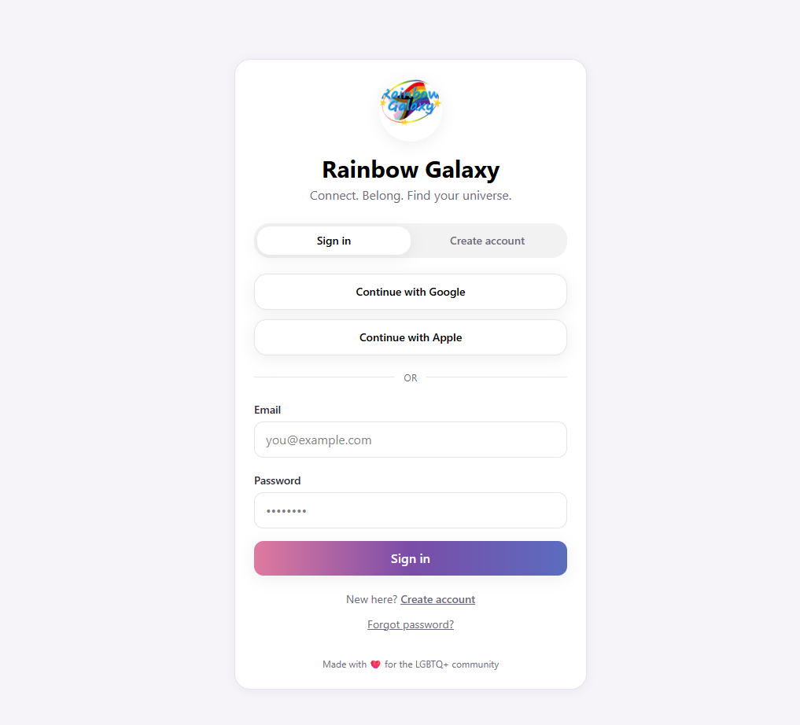
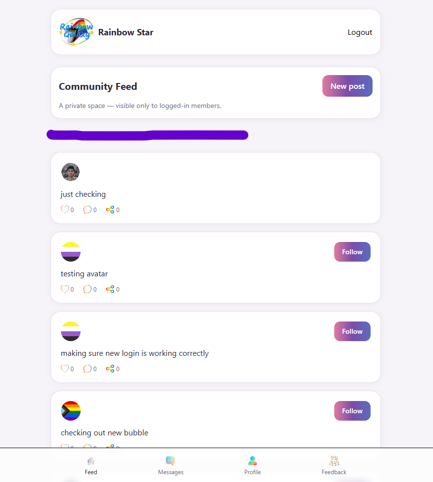
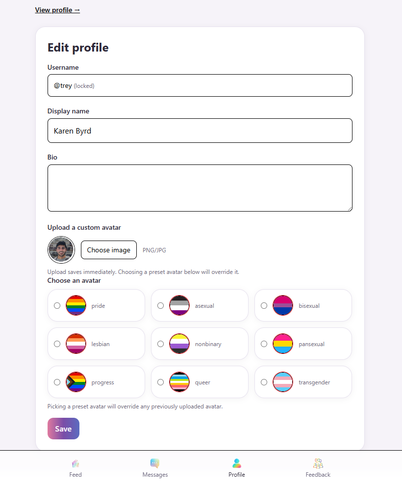
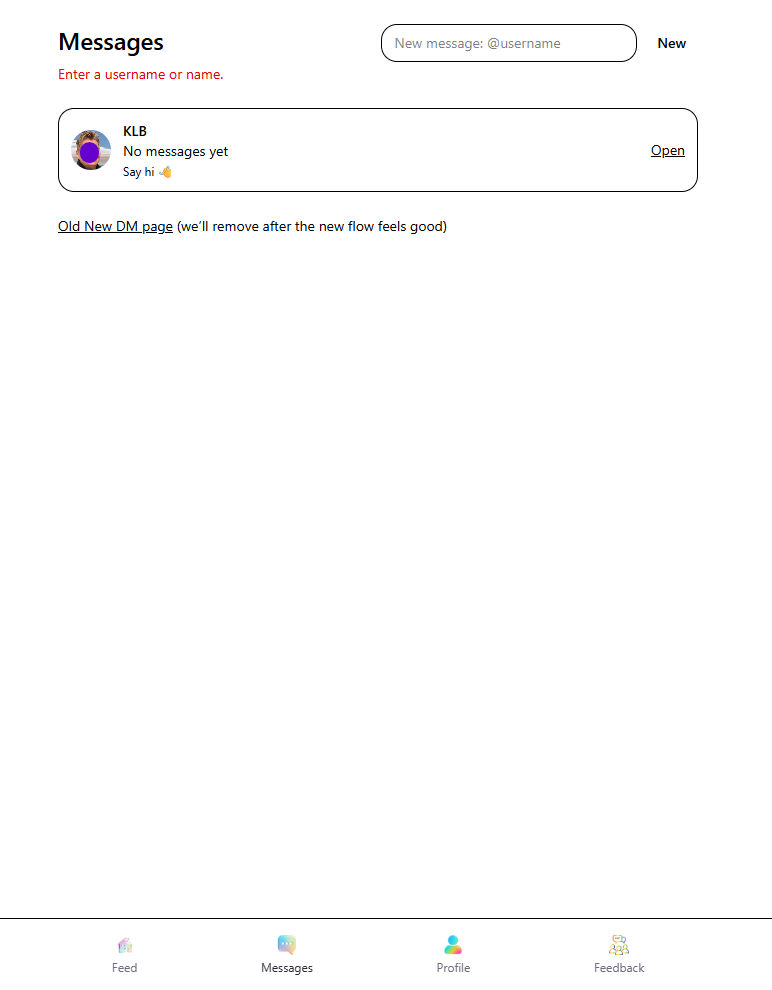
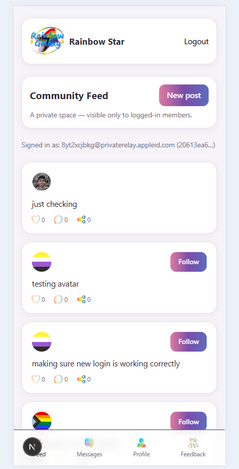

# 🌈 Rainbow Galaxy

> A modern social platform built for connection, expression, and community.


---

## About Rainbow Galaxy

Rainbow Galaxy is a modern social networking platform focused on identity, creativity, community, and meaningful interaction.

The platform is being designed with a clean user experience, secure authentication, responsive design, and scalable architecture using modern web technologies.

This repository exists as the public-facing project showcase for Rainbow Galaxy.

---

## Features

- Secure authentication
- Google OAuth sign-in
- Apple OAuth sign-in
- User profile system
- Editable profile settings
- Private authenticated feed
- Follow-based social structure
- Responsive mobile-first design
- Server-side rendering architecture
- Supabase-powered backend
- Messaging system foundation
- Protected application routes

---

## Tech Stack

| Technology | Purpose |
|---|---|
| Next.js App Router | Frontend framework |
| React | UI library |
| TypeScript | Type safety |
| Tailwind CSS v4 | Styling system |
| Supabase | Authentication & database |
| PostgreSQL | Database engine |
| Vercel | Deployment |

---

## Domains

Rainbow Galaxy currently owns the following domains:

- `raynbogalaxy.social`
- `raynbogalaxy.com`
- `raynbogalaxy.net`
- `raynbogalaxy.info`

Primary domain:

```txt
raynbogalaxy.social
```

---

## Screenshots & Previews

### Login & Authentication

Authentication flow with secure sign-in options including OAuth providers and protected route handling.



---

### Feed Interface

Private authenticated feed structure with responsive layout and user navigation.



---

### Profile Settings

Customizable user profile settings including username, avatar selection, and account management.



---

### Messaging System

Direct messaging and conversation system currently in active development.



---

### Mobile Experience

Responsive mobile-first navigation and layout optimized for smaller devices.



---

## Preview Notes

All screenshots shown are development previews captured from local and staging environments during active development.

UI, branding, features, and layouts may continue evolving throughout the development process.

---

## Development

Rainbow Galaxy is currently under active development.

Features, UI, and architecture may evolve over time as the platform grows.

---

## Repository Purpose

This public repository exists to:

- Showcase the Rainbow Galaxy project
- Present branding and platform direction
- Demonstrate technologies used
- Share project updates and previews
- Provide a public-facing portfolio piece

This repository does not contain private application source code or sensitive configuration.

---

## Developed By

Built and maintained by **Blue Byrd Development**.

🌐 https://www.bluebyrddevelopment.com

---

## License

This repository is licensed under an **All Rights Reserved** license.

See [`LICENSE.md`](./LICENSE.md) for additional details.
